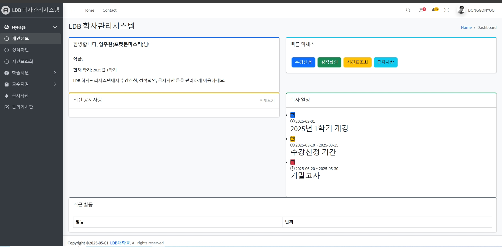
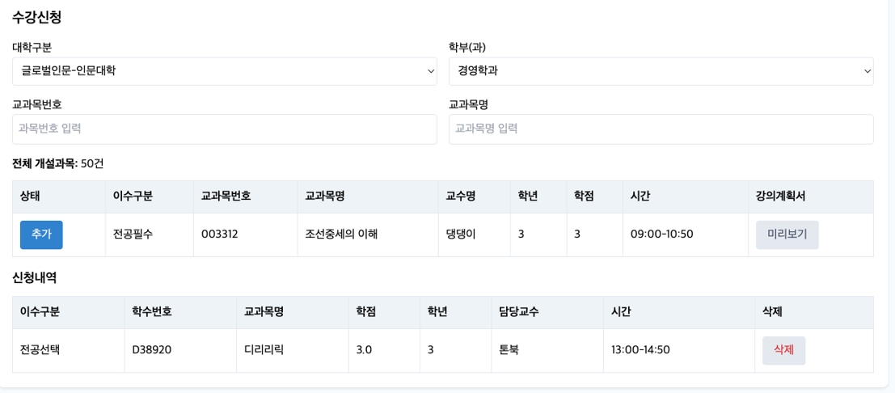

# 🎓 학사 관리 시스템 (Academic Management System)


> JSP + Servlet + MyBatis 기반의 Model2 MVC 패턴 웹 프로젝트  
> Bootstrap5 및 AdminLTE4 템플릿 기반 반응형 UI 학사관리 시스템

---

## 📸 데모 스크린샷

> 아래는 실제 시스템 UI의 예시입니다.

<table>
  <tr>
    <th>메인 화면</th>
    <th>수강 신청 화면</th>
  </tr>
  <tr>
    <td align="center">
      
    </td>
    <td align="center">
      
    </td>
  </tr>
</table>

---

## 📌 프로젝트 개요

**학사 관리 시스템**은 학생과 교수 간의 효율적인 학사 행정 처리를 돕기 위해 개발된 웹 기반 시스템입니다.  
학생은 수강신청, 시간표 확인, 성적 확인 등의 기능을 사용할 수 있으며, 교수는 수업 등록, 출석 체크, 성적 입력 등을 수행할 수 있습니다.  
또한, 공지사항과 문의 게시판 기능을 통해 원활한 커뮤니케이션 환경을 제공합니다.

---

## 🎯 주요 기능

### 👩‍🎓 학생 기능
- 학생 등록 및 정보 관리
- 수강 신청 및 취소
- 시간표 확인
- 성적 확인
- 문의 게시판 등록/조회

### 👨‍🏫 교수 기능
- 수업 개설 및 관리
- 출석 체크
- 성적 입력 및 수정
- 공지사항 게시판 작성

### 📢 공통 기능
- 공지사항 열람
- 게시판 답변
- 관리자 기능 (학생/교수 등록 및 전반적 관리)

---

## ⚙️ 사용 기술 스택

| 분류           | 기술 내용 |
|----------------|-----------|
| **백엔드**     | Java, JSP, Servlet, MyBatis |
| **프론트엔드** | HTML5, CSS3, JavaScript, Bootstrap 5, AdminLTE 4 |
| **템플릿 엔진**| JSP (Java Server Pages) |
| **데이터베이스** | MariaDB |
| **라이브러리** | jackson, taglibs-standard, cos.jar, mail-1.4.7.jar |
| **아키텍처**    | Model2 (MVC 패턴) 방식 |

---

## 🖥️ 프로젝트 구조

```
📁 src/
├── 📁 controller/        # Servlet 기반의 각종 컨트롤러 (학생, 교수, 관리자 등)
├── 📁 model/
│   ├── 📁 dao/           # DB 접근 로직 (MyBatis Mapper 인터페이스)
│   └── 📁 dto/           # VO, DTO 클래스
├── 📁 service/           # 비즈니스 로직 처리 계층
├── 📁 resources/
│   ├── 📁 mapper/        # MyBatis 매퍼 XML 파일
│   └── db.properties    # DB 접속 정보

📁 webapp/
├── 📁 assets/            # 정적 리소스 (CSS, JS, 이미지 등)
├── 📁 WEB-INF/
│   ├── 📁 views/         # JSP 뷰 페이지들
│   └── web.xml          # 서블릿 설정 파일
```
---

## 🔧 향후 개선 예정

- [ ] JWT 기반 로그인 보안 및 세션 관리 고도화
- [ ] 학사 일정 캘린더 기능 추가 (공휴일, 시험일 등 포함)
- [ ] 성적 일괄 등록 (엑셀 업로드 등)
- [ ] REST API 분리
- [ ] JUnit 단위 테스트 / CI 환경 도입
- [ ] Docker 기반 배포 자동화 구성

## 동곤 깃헙:https://github.com/donggonyoo
